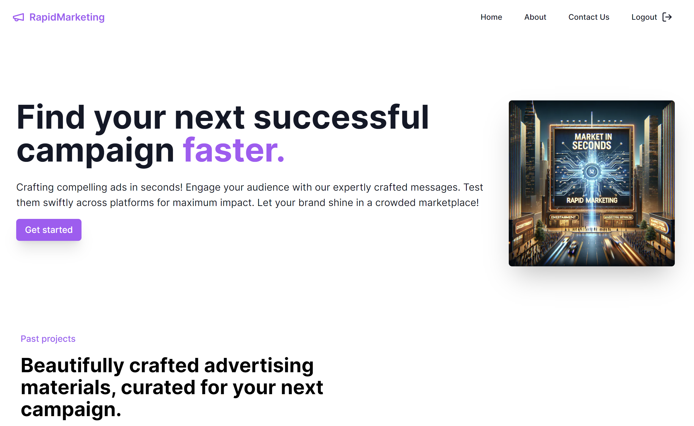
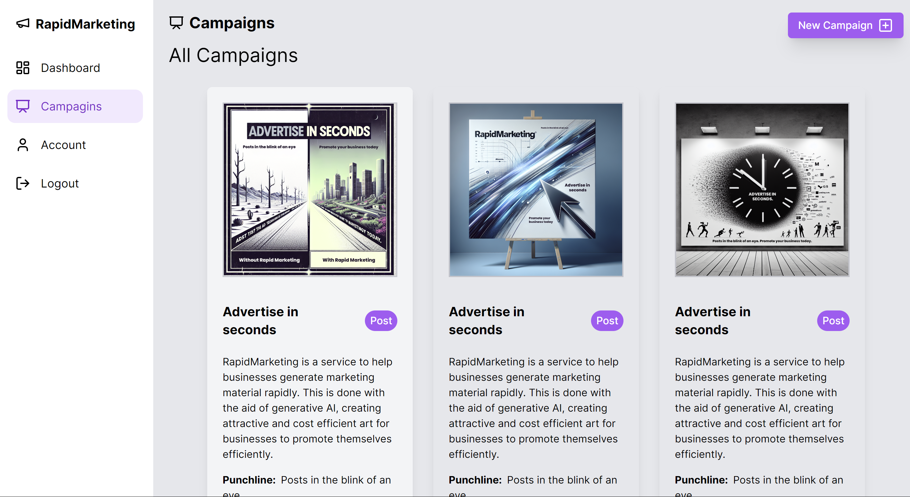
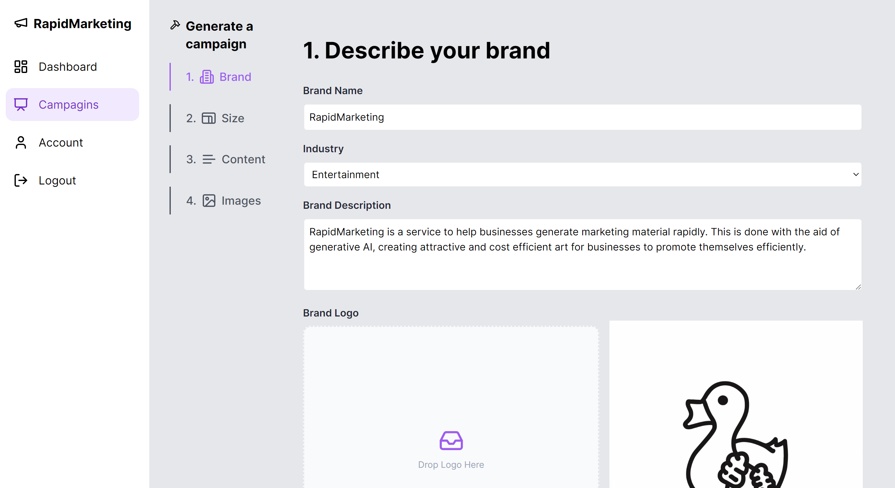
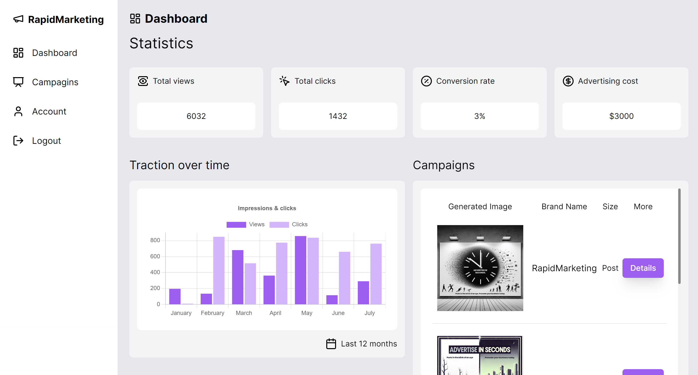

# Rapid Marketing

## Inspiration

During my interactions with various startup accelerator groups, I engaged with numerous founders and identified a common challenge: **Effective, low-cost marketing**. Advertising expenses can quickly escalate, especially for startups with limited funding. Finding marketing strategies that resonate with customers while keeping costs manageable is crucial.

## What it does

*Rapid Marketing* generates customized marketing materials for each product, allowing users to **quickly test** different designs. The goal is to improve the **conversion rate**—the percentage of users who take a desired action (such as making a purchase or signing up) after interacting with the marketing content. By optimizing designs, we aim to maximize conversions while maintaining cost-effectiveness.

## How we built it

Our modern web app leverages popular frameworks and technologies. Here are the key components:

1. **Perfect Prompts with Gemini**: Generating images requires crafting precise prompts before sending them to a text-to-image model. We utilize **Google's Gemini pro vision model** for this purpose. Its multi-modal capabilities allow users to provide example outputs they desire, shaping the final image output. With Gemini's **state-of-the-art reasoning**, we ensure that the prompts lead to attractive marketing materials.

2. **NextJS for Performance**: We chose **NextJS** as our full-stack framework due to its performance and optimization features. Its server-side rendering capabilities, SEO benefits, and ease of deployment contribute to a seamless user experience.

3. **Firebase and Tailwind CSS**: We rely on **Firebase** for blazing-fast Firestore and Firestorage. Additionally, **Tailwind CSS** provides flexibility in styling our web app.

**Screenshots**
----------

Screenshot of the home page

Screenshot of the campaigns

Screenshot of the edit campaign

Screenshot of the dashboard

## Challenges we ran into

While initially aiming to use Imagen for image generation, we encountered difficulties gaining access to the API. Despite this setback, we adapted and found alternative solutions.

## Accomplishments we're proud of

Building Rapid Marketing was both enjoyable and meaningful. Users have already benefited from the generated marketing materials. They reported that the images inspired designs leading to high conversion rates—an achievement we take pride in.

## What we learned

Gemini provides a wealth of options for text generation, from blocking harmful responses to multi-modal models. Leveraging these incredible technologies enhances user experience and solves real-world problems.

## What's next for Rapid Marketing

Our roadmap includes:
- **Prompt Engineering**: We'll refine our image generation capabilities by investing in prompt engineering.
- **Staying Current**: We'll keep up-to-date with the latest state-of-the-art image generation models.
- **Wider Impact**: We aim to get Rapid Marketing into the hands of more users, making a real change in the marketing industry.
